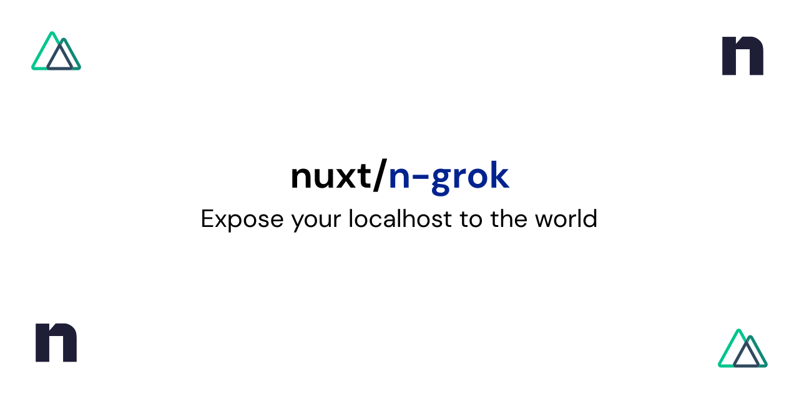

[](https://ngrok.nuxtjs.org)

# @nuxtjs/ngrok

[![npm version][npm-version-src]][npm-version-href]
[![npm downloads][npm-downloads-src]][npm-downloads-href]
[![Github Actions CI][github-actions-ci-src]][github-actions-ci-href]
[![Codecov][codecov-src]][codecov-href]
[![License][license-src]][license-href]

> [ngrok](https://github.com/bubenshchykov/ngrok) integration for [NuxtJS](https://nuxtjs.org)

- [✨ &nbsp;Release Notes](https://ngrok.nuxtjs.org/releases)
- [📖 &nbsp;Documentation](https://ngrok.nuxtjs.org)

## Features

- Secure https for all tunnels
- Show your work to anyone
- Use the API to test web hooks
- Test your UI in cloud browsers

[📖 &nbsp;Read more](https://ngrok.nuxtjs.org)

## Quick Setup

1. Add `@nuxtjs/ngrok` dependency to your project

```bash
yarn add @nuxtjs/ngrok # or npm install @nuxtjs/ngrok
```

2. Add `@nuxtjs/ngrok` to the `buildModules` section of `nuxt.config.js` (or `modules` if on Nuxt < 2.9>)

```js
{
  buildModules: [
    '@nuxtjs/ngrok',
  ],
}
```

## Add Options

Add authorization and more using the module options.

```js
ngrok: {
    // module options
    authtoken: 'my-ngrok-authtoken'
    auth: 'my-user:my-pwd',
    region: 'eu',
    addr: 8080,
    proto: 'http',
    subdomain: 'my-subdomain'
  }
```

See [module options](https://ngrok.nuxtjs.org/options).

## Usage

Run the `dev`command and you will see your public URL in the Nuxt CLI which you can then share with anyone, anywhere in the world.

Simple use example:

```bash
yarn dev
or
npm run dev
```

See [Usage](https://ngrok.nuxtjs.org/usage).

## Development

1. Clone this repository
2. Install dependencies using `yarn add` or `npm install`
3. Start development server using `yarn dev` or `npm run dev`

## License

[MIT License](./LICENSE)

<!-- Badges -->
[npm-version-src]: https://img.shields.io/npm/v/@nuxtjs/ngrok/latest.svg
[npm-version-href]: https://npmjs.com/package/@nuxtjs/ngrok

[npm-downloads-src]: https://img.shields.io/npm/dm/@nuxtjs/ngrok.svg
[npm-downloads-href]: https://npmjs.com/package/@nuxtjs/ngrok

[github-actions-ci-src]: https://github.com/nuxt-community/ngrok-module/workflows/ci/badge.svg
[github-actions-ci-href]: https://github.com/nuxt-community/ngrok-module/actions?query=workflow%3Aci

[codecov-src]: https://img.shields.io/codecov/c/github/nuxt-community/ngrok-module.svg
[codecov-href]: https://codecov.io/gh/nuxt-community/ngrok-module

[license-src]: https://img.shields.io/npm/l/@nuxtjs/ngrok.svg
[license-href]: https://npmjs.com/package/@nuxtjs/ngrok
